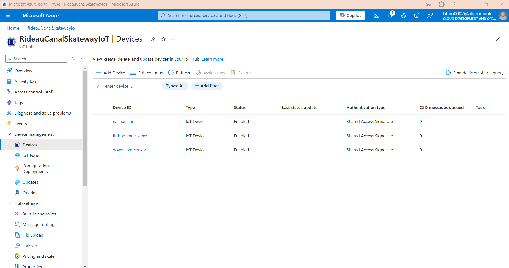

# Rideau Canal Skateway Monitoring Solution

## Performed By
### **Group - 21** 
- **Deval Bhungaliya - bhun0002**
- **Bhavika Pathria - path0053**
- **Neetika Prashar - pras0044**

## Scenario Description
The Rideau Canal Skateway, a world-renowned historic attraction in
Ottawa, requires continuous monitoring to ensure the safety of skaters.
Factors like ice thickness, surface temperature, snow accumulation, and
external temperature significantly affect the safety and usability of
the canal. This project addresses the challenge of real-time monitoring
by implementing a system to:

1.  Simulate IoT sensors at key locations along the canal.

2.  Process incoming sensor data in real time to detect unsafe
    conditions.

3.  Store the processed data in Azure Blob Storage for future analysis.

This solution enables proactive safety measures and operational
insights, helping the National Capital Commission (NCC) maintain the
Skateway efficiently.

## System Architecture

The system consists of three main components:

1.  **IoT Sensors**: Simulate real-time data from three locations along
    the Rideau Canal: Dow\'s Lake, Fifth Avenue, and NAC.

2.  **Azure IoT Hub**: Serves as the ingestion point for sensor data.

3.  **Azure Stream Analytics**: Processes the incoming data to calculate
    metrics like average ice thickness and maximum snow accumulation
    over 5-minute windows.

4.  **Azure Blob Storage**: Stores processed data in organized JSON/CSV
    formats for further analysis.

**Data Flow Diagram**


## Implementation Details
### IoT Sensor Simulation

-   **How It Works**:

    -   A Python script simulates IoT sensors at three locations (Dow\'s
        Lake, Fifth Avenue, and NAC) along the Rideau Canal.

    -   Every 10 seconds, each sensor sends a JSON payload to Azure IoT
        Hub containing:

        -   iceThickness: Random value between 20--35 cm.

        -   surfaceTemperature: Random value between -10--0 °C.

        -   snowAccumulation: Random value between 5--15 cm.

        -   externalTemperature: Random value between -15--5 °C.

        -   timestamp: Current UTC time in ISO 8601 format.

-   **JSON Payload Structure**:

```json
{
  "location": "Dow's Lake",
  "iceThickness": 27,
  "surfaceTemperature": -1,
  "snowAccumulation": 8,
  "externalTemperature": -4,
  "timestamp": "2024-11-23T12:00:00Z"
}
```


### Azure IoT Hub Configuration

#### Setup Steps:

##### Step 1. Create IoT Hub:
- In the Azure portal, create an IoT Hub.
- Select a **standard tier** to enable support for message routing.

##### Step 2. Add Device:
- Navigate to the **"Devices"** section within the IoT Hub.
- Add a new device by specifying a unique Device ID.
- Once created, **copy the connection string** for this device; you will use it in the simulation script.

### Azure Stream Analytics Job Configuration

#### Step 1: Create the Stream Analytics Job
- In the Azure Portal, search for **Stream Analytics jobs** and click **Create**.
- Provide a name for the job and select the appropriate resource group.
- Choose **Cloud** as the hosting environment and click **Create**.

---

#### Step 2: Define Input
- Navigate to the **Inputs** section of the job and click **Add**.
- Select **IoT Hub** as the input source and configure the required settings:
  - Select our existing IoT Hub namespace.
  - Use the **iothubowner** policy for authorization.
  - Specify a consumer group, either **$Default** or a newly created one.
  - Choose **JSON** as the serialization format.

---

#### Step 3: Define Output
- Navigate to the **Outputs** section and click **Add**.
- Select **Blob Storage** as the output destination and configure:
  - Select the desired Azure Storage Account.
  - Specify a container for storing processed data or create one if needed.
  - Optionally, define a path pattern for organizing output files.
  - Choose the preferred output format, either **JSON** or **CSV**.

---

#### Step 4: Write the Stream Analytics Query
- Configure a query to process the data from the input source.
- Apply logic to calculate metrics like average and maximum values over a specified time window.
- Ensure the query groups results by relevant parameters such as location.

```sql
SELECT
    IoTHub.ConnectionDeviceId AS DeviceId,
    AVG(iceThickness) AS AvgIceThickness,
    MAX(snowAccumulation) AS MaxSnowAccumulation,
    System.Timestamp AS EventTime
INTO
    [output]
FROM
    [input]
GROUP BY
    IoTHub.ConnectionDeviceId, TumblingWindow(minute, 5)
```
- Sample Output: Data will be stored in the Blob Storage container in JSON format. A sample output file might look like:
```json
{"DeviceId":"dows-lake-sensor","AvgIceThickness":31.004488089156016,"MaxSnowAccumulation":18.193725043097018,"EventTime":"2024-11-30T00:00:00.0000000Z"}
{"DeviceId":"fifth-avenue-sensor","AvgIceThickness":30.241590829054523,"MaxSnowAccumulation":19.670275627963278,"EventTime":"2024-11-30T00:00:00.0000000Z"}
{"DeviceId":"nac-sensor","AvgIceThickness":30.578841873368724,"MaxSnowAccumulation":19.72825804787723,"EventTime":"2024-11-30T00:00:00.0000000Z"}
```

---

#### Step 5: Save and Start the Job
- Save the configuration and the Stream Analytics query.
- Click **Start** to activate the job and begin processing data in real time.

---

#### Step 6: Verify the Job and Output
- Navigate to the **Monitoring** tab in the Azure Portal to confirm that the job is running and processing data correctly.
- Check the specified Blob Storage container to ensure the processed data is being saved in the desired format and structure.


### Azure Blob Storage

#### Data Organization

#### Container Structure

##### Data Storage
- The data is stored in a container named **iotoutput**, which serves as the central storage location for all processed data output by the Stream Analytics job.

---

##### File Naming Convention
- The output files are named randomly by Azure Stream Analytics.
- File names include unique identifiers and follow a system-generated format, such as:
  - `0_37cbf2a63e2446a1bed9f04d2a9d771f_1.json`
- Each file represents a segment of the processed data, updated at regular intervals based on the tumbling window configuration (e.g., every 5 minutes).

---

##### File Format
- Data is stored in **JSON format**, a structured and machine-readable format.
- JSON allows for efficient parsing and querying of data, making it suitable for integration with various services and analytics tools.

---

##### Data Content
Each JSON file contains aggregated data based on the Stream Analytics query. The content typically includes:
- **DeviceId:** Identifies the specific sensor (e.g., `dows-lake-sensor`, `fifth-avenue-sensor`, `nac-sensor`).
- **AvgIceThickness:** The average ice thickness over the aggregation window.
- **MaxSnowAccumulation:** The maximum snow accumulation during the same window.
- **EventTime:** The timestamp indicating the end of the aggregation period.

---

##### Processing and Update Frequency
- Data in the JSON files is updated based on the tumbling window configuration of the Stream Analytics job.
- In this case, the data is processed and saved to Blob Storage every **5 minutes**.
- After **20 minutes** of processing, multiple entries are added to the same file, with each entry corresponding to a **5-minute aggregation window**.


## Usage Instructions

### Running the IoT Sensor Simulation

#### Install Python

- Ensure that Python is installed on our system.
- If not, download and install it from the official Python website.

---

#### Set Up the Script

- Save the Python script in a file named `simulate_sensor_sensor_name.py`.
```python

import time
import random
from azure.iot.device import IoTHubDeviceClient, Message

CONNECTION_STRING =  "our Connection String for each sensor", # My Connection String : HostName=RideauCanalSkatewayIoT.azure-devices.net;DeviceId=dows-lake-sensor;SharedAccessKey=2FdwxQdkqj08SIPE4bEwXpjT8fCw/4dl3UvnIz2fqFg=

def get_telemetry():
    return {
        "iceThickness": random.uniform(20.0, 40.0),
        "surfaceTemperature": random.uniform(-5.0, 2.0),
        "snowAccumulation": random.uniform(0.0, 20.0),
        "externalTemperature": random.uniform(-10.0, 5.0),
        "timestamp": time.strftime("%Y-%m-%dT%H:%M:%SZ")
    }

def main():
    # Create IoT Hub client for the sensor
    client = IoTHubDeviceClient.create_from_connection_string(CONNECTION_STRING)

    print("Sending telemetry to IoT Hub...")
    try:
        while True:
            # Generate and send telemetry data
            telemetry = get_telemetry()
            message = Message(str(telemetry))
            client.send_message(message)
            print(f"Sent message: {message}")
            time.sleep(10)
    except KeyboardInterrupt:
        print("Stopped sending messages.")
    finally:
        # Disconnect the client
        client.disconnect()

if __name__ == "__main__":
    main()

```
**Explanation:**
This Python script simulates an IoT device sending telemetry data to an Azure IoT Hub. 
It uses a connection string to authenticate and connects to the IoT Hub via the `IoTHubDeviceClient`. 
The script generates random temperature and humidity data through the `get_telemetry` function and continuously sends this data as messages to the IoT Hub every 10 seconds. 
It handles keyboard interrupts (e.g., Ctrl+C) to stop the loop gracefully and disconnects the client.

---

#### Install Required Libraries

- Open a terminal or command prompt.
- Install the `azure-iot-device` library to simulate sensor data. Run the following command:

```bash
pip install azure-iot-device
```

---

#### Update the Connection String

- Replace the `CONNECTION_STRING` in the script with the appropriate connection string for our IoT device.

---

#### Run the Script

- Execute the script by running it in the terminal or command prompt.

---

#### Monitor the Output

- The script will simulate telemetry data from three locations: **Dow's Lake**, **Fifth Avenue**, and **NAC**.
- It will display each generated message in the terminal, showing data such as:
  - Ice thickness
  - Surface temperature
  - Snow accumulation
  - External temperature

---

#### Stop the Simulation

- To stop the simulation, press **Ctrl + C** in the terminal.
- The script will handle the interruption and disconnect cleanly.


### Configuring Azure Services

#### Step 1: Set Up Azure IoT Hub

##### 1. Create an IoT Hub
1. In the Azure Portal, search for **IoT Hub** and click **Create**.
2. Provide a name for our IoT Hub and select a resource group.
3. Choose the **Free Tier** (if available) for testing purposes and create the IoT Hub.

##### 2. Register a Device
1. In the IoT Hub, go to the **Devices** section and click **Add Device**.
2. Provide a Device ID (e.g., `nac-sensor`, `fifth-avenue-sensor`, `dows-lake-sensor`) and click **Save**.

3. After the device is created, click on it to view the connection string. Copy the connection string for use in the Python script that going to simulate the sensor.


##### 3. Install Required Libraries

Install the `azure-iot-device` library to simulate sensor data. Run the following command:

```bash
pip install azure-iot-device
```
##### 4. Run the Python Script to Simulate Sensor Data
Use the following previously generated python scripts `simulate_dows_lake_sensor.py`, `simulate_fifth_avenue_sensor.py`, `simulate_nac_sensor.py` to simulate telemetry data and send it to the IoT Hub. Replace the `CONNECTION_STRING` with the device connection string you copied earlier.


##### 5. Run the Script
Execute the script to start sending telemetry data to our IoT Hub.

#### Step 2: Create and Configure a Stream Analytics Job
##### 1. Create the Stream Analytics Job
1. In the Azure Portal, search for Stream Analytics jobs and click Create.
2. Provide a name for our job and select the appropriate resource group.
3. Choose Cloud as the hosting environment and create the job.


##### 2. Define Input
1. In the Stream Analytics job, go to the Inputs section and click Add.
2. Choose IoT Hub as the input source.
3. Provide the following details:
   - IoT Hub Namespace: Select our IoT Hub.
   - IoT Hub Policy Name: Use the iothubowner policy.
   - Consumer Group: Use $Default or create a new consumer group in our IoT Hub.
   - Serialization Format: Choose JSON.

##### 3. Define Output
1. Go to the Outputs section and click Add.
2. Choose Blob Storage as the output destination.
3. Provide the following details:
   - Storage Account: Select our Azure Storage Account.
   - Container: Create or choose an existing container for storing results.
   - Path Pattern: Optionally define a folder structure (e.g., output/{date}/{time}).

##### 4. Write the Stream Analytics Query
Go to the Query tab and replace the default query with the following:


```sql

SELECT
    IoTHub.ConnectionDeviceId AS DeviceId,
    AVG(Input.iceThickness) AS AvgIceThickness,
    MAX(Input.snowAccumulation) AS MaxSnowAccumulation,
    System.Timestamp AS EventTime
INTO
    [output]
FROM
    [input]
GROUP BY
    IoTHub.ConnectionDeviceId, TumblingWindow(minute, 5)

```


**Explanation:** This query processes streaming data in Azure Stream Analytics. 
It calculates the **average temperature and humidity** from incoming telemetry data grouped by device `Input.location` over 60-second intervals using a tumbling window. 
The results include the device ID, the computed averages, and the event timestamp `System.Timestamp`. 
The processed data is then written to an output sink specified by `output`. 
##### 5. Save and Start the Job
Save the query and click Start on the Stream Analytics job.

### Accessing Stored Data in Azure Blob Storage

#### Steps to Locate and View Processed Data

1. **Log in to the Azure Portal**
   - Navigate to the [Azure Portal](https://portal.azure.com) and sign in with our credentials.

2. **Access the Storage Account**
   - In the Azure Portal, search for **Storage Accounts** in the top search bar.
   - Select the storage account associated with our Stream Analytics job.

3. **Navigate to the Container**
   - Once inside the storage account, go to the **Containers** section.
   - Locate and select the container named **iotoutput** (or the container specified during job setup).
   

4. **Download or Preview Files**
   - Select a file (e.g., a `.json` file) to preview its content directly in the Azure Portal.
   - Alternatively, download the file to our local machine for detailed analysis using tools like a text editor, JSON viewer, or data processing software.
   
   
5. **Verify Data Content**
   - Open the downloaded file or use the preview feature to confirm that the content matches the expected output, such as:
     - DeviceId
     - AvgIceThickness
     - MaxSnowAccumulation
     - EventTime

## Results

### Key Findings
1. The Stream Analytics job successfully processed real-time data from IoT sensors and stored the aggregated results in Azure Blob Storage.
2. Key metrics derived from the data include:
  - **Average Ice Thickness:** Provides insights into ice conditions over specific intervals.
  - **Maximum Snow Accumulation:** Highlights peak snow accumulation during the same time windows.

### Sample Aggregated Outputs
1. The processed data can be found in the [output.json](JSON-Output/0_37cbf2a63e2446a1bed9f04d2a9d771f_1.json) file.

### Accessing the Data
1. Navigate to the **iotoutput** container in our Azure Blob Storage account to view the stored files.


## Reflection

### Implementation Experience
1. The implementation of the Stream Analytics job was smooth and seamless. All steps, from configuring inputs and outputs to writing the query and processing data, were executed without any issues.

### Challenges and Solutions
1. In this assignment, no challenges or difficulties were encountered during the setup or execution phases. 
2. The Azure platform's intuitive interface and comprehensive documentation greatly facilitated the process.

### Overall Learning
1. This assignment provided valuable insights into real-time data processing with Azure Stream Analytics.
2. It demonstrated the ease of integrating Azure services, such as IoT Hub and Blob Storage, to create an end-to-end data processing pipeline. 

